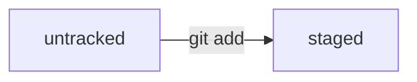

## Guide для работы с Git.
____

#### Алгоритм создания проекта в git и загрузки его в публичный репозиторий GitHub

Для работы с git необходимо знать как работать с файлами и папками в командной строке git.
Для этого мы изучим основные команды, которые нам позволят создавать папки и файлы в командной строке git, осуществлять переходы между директориями.

#### Работа с файлами и папками

Для создания папки в командной строке git необходимо использовать команду:
```bash
$ mkdir new_folder
```
Для создания файла в командной строке git необходимо использовать команду:
```bash
$ touch new_file.txt
```
Для удаления файла в командной строке git необходимо использовать команду:
```bash
$ rm new_file.txt
```
Для удаления пустой директории в командной строке git необходимо использовать команду:
```bash
$ rmdir new_folder
```
Для удаления директории и всех вложенных директорий и файлов в командной строке git необходимо использовать команду:
```bash
$ rm -r new_folder
```
Для просмотра содержимого директории в командной строке git необходимо использовать команду:
```bash
$ ls
```
При запуске командной строки git она открывается в вашей домашней директории. 
Посмотреть где сейчас вы находитесь в командной строке можно воспользоваашись командой:
```bash
$ pwd
```
Для перемещения между директориями используется команда, где вместо *folder* необходимо написать полный путь директории, в которую необходимо перейти:
```bash
$ cd folder
```
Для перемещения в домашнюю директории из любой другой директории можно воспользоваться командой:
```bash
$ cd ~
```
____
#### Работа с GIT

Для того, чтобы создать репозиторий, необходимо сделать следующее:
  
1. Для начала необходимо создать папку нашего проета.
2. Перейти в эту папку и произвести инициализацию репозитория git.
3. Поместить файлы в репозиторий, историю изменений которых мы и будем сохранять.
4. Добавить файлы для отслеживания.
5. Создать коммит.

На этом этапе мы создадим локальный репозиторий, который будет храниться только у нас на компьютере. 
Итак, подробнее опишем команды для выполнения этих шагов.

После того как мы создали директорию будущего репозитория Git, переходим в нее. 
И выполняем команду:
```bash
$ git init
```
Если вы случайно проинициализировали репозиторий не в той директории, то ее можно "разгитить" с помощью команды:
```bash
$ rm -rf .git
```
Для просмотра состояния репозитория используется команда:
```bash
$ git status
```
Далее мы создаем файлы, копируем их в репозиторий. Для начала их отслеживания и сохранения истории используется команда:
```bash
$ git add --all
```
Эта команда добавляет сразу все файлы в директории. Для добавления одного файла, вместо ключа *--all* необходимо написать имя файла:
```bash
$ git add filename.txt
```
После изменений файла и перед созданием коммита всегда нужно добавлять новое состояние файла, используя команду *add*. 
Теперь мы можем создать наш коммит (сохранить текущее состояние всех файлов в репозитории). 
Для этого используем команду с ключем *-m* после которого в кавычках пишем имя коммита:
```bash
$ git commit -m "My first commit!"
```
Для просмотра истории репозитория используем команду:
```bash
$ git log
```
Итак, наш локальный репозиторий создан. В нем создан наш первый коммит. 
Далее необходимо связать наш локальный репозиторий с удаленным репозиторием. 
____
#### Связываем локальный репозиторий с удаленным
В нашей статье мы опустим детали по создания аккаунта на GitHub.
Данную информацию вы можете изучить перейдя по [ссылке](https://docs.github.com/ru/get-started/signing-up-for-github/signing-up-for-a-new-github-account).
После того, как вы создали аккаунт, а также локальный репозиторий перейдем к связыванию наших локальных и удаленных репозиториев.
Инструкцию по созданию удаленного репозитория на GitHub вы можете посмотреть по [ссылке](https://docs.github.com/ru/get-started/quickstart/create-a-repo).
Инструкцию по генерированию и добавлению ключей доступа вы можете посмотреть по [ссылке](https://docs.github.com/ru/authentication/managing-commit-signature-verification).
После того, как вы создали удаленный репозиторий, настроили ключи доступа. Перейдем к связыванию репозиторив. 
Для этого на странице удаленного репозитория необходимо скопировать SSH ссылку.
Открываем командную строку и переходим в локальный репозиторий. Выполняем команду:
```bash
$ git remote add origin git@github.com:%ИМЯ_АККАУНТА%/first-project.git 
```
Убедиться, что репозитории связаны можно выполнив команду:
```bash
$ git remote -v
origin    git@github.com:%ИМЯ_АККАУНТА%/%ИМЯ-ПРОЕКТА%.git (fetch)
origin    git@github.com:%ИМЯ_АККАУНТА%/%ИМЯ-ПРОЕКТА%.git (push) 
```
В выводе мы получим строки аналогичные строкам показаным выше.
Для отправки всех изменений в удаленный репозиторий используется команда:
```bash
$ git push
```
Теперь мы связали наши репозитории и отправили в удаленный все изменения. 
  
Далее после внесения изменений в файлы нашего проекта и при необходимости зафиксировать все изменения необходимо проделать следующее:
1. Добавить все файлы командой *$git add --all*.
2. Создать коммит *$git commit -m "commit name"*.
3. Отправить изменения в удаленный репозиторий *$git push*.
  
Таким образом, мы научились создавать локальный репозиторий. Создавать коммит. 
Отправлять все изменения в локальном репозитории в удаленный репозиторий.

____
#### Хеш - идентификатор коммита

**Хеширование** - это способ преобразования набора исходных данные и получение в результате уникального идентификатора.

Git хеширует (преобразует) информацию о коммите с помощью алгоритма SHA-1 (от англ. Secure Hash Algorithm — «безопасный алгоритм хеширования») 
и получает для каждого коммита свой уникальный хеш — результат хеширования.

Хеш коммита мы можем увидеть, использовав команду:
```bash
$ git log
```
После ее вызова мы увидим список коммитов. Каждый коммит состоит из следующего набора данных:
- Хеш коммита
- Author - имя автора и его электронная почта
- Date - дата и время создания коммита
- Сообщение коммита

Мы можем заметить, что хеш состоит из 40 символов. Вывод полного лога может быть неудобен, если в репозитории
уже очень много коммитов, тогда можно использовать вывод сокращенного лога, команда:
```bash
$ git log --oneline
```
В выводе мы получим только первые несколько символов хеша каждого коммита и их комментарии.
____
#### Файл HEAD
При вызове команды git log вы также могли заметить надпись (HEAD -> master) после хеша одного из коммитов. 
Сейчас разберемся, что это означает. Если мы перейдем в папку *.git* и посмотрим ее содержимое, то там есть файл **HEAD**.
```bash
$ cd .git

$ ls
COMMIT_EDITMSG  config       hooks/  info/  objects/
HEAD            description  index   logs/  refs/

$ cat HEAD
ref: refs/heads/master
```
Посмотрев содержимое файла **HEAD** командой *cat* мы видим что там хранится ссылка на файл master. 
Посмотрим его содержимое.
```bash
$ cat refs/heads/master
e5892cde8f34b5c781a41ae9390736fb9eb4baf9
```
Видим что в нем хранится хеш. И это хеш последнего коммита. Проверяем это, используя команду *log*.
```bash
$ git log
commit e5892cde8f34b5c781a41ae9390736fb9eb4baf9 (HEAD -> master)
Author: Lopin_AN <lopin_an@atomtex.com>
Date:   Fri Jun 30 09:32:35 2023 +0300

    Добавить информацию о логе.
```
Когда вы делаете коммит, **Git** обновляет *refs/heads/master* — записывает в него хеш последнего коммита. 
Получается, что **HEAD** тоже обновляется, так как ссылается на *refs/heads/master*.
При работе с **Git** указатель **HEAD** используется довольно часто. 
Если нужно передать последний коммит, то вместо его хеша можно просто написать слово **HEAD** — **Git** поймёт, что вы имели в виду последний коммит.
____
#### Статусы файлов в Git
Самая главная задача **Git** - отслеживание изменений файлов в репозитории. Для этого все файлы в репозитории
помечаются каким-либо статусов. Рассмотрим их.
- untracked
- tracked
- staged
- modified

Когда мы создаем новый файл в репозитории у него статус *untracked*. Далее чтобы начать тслеживать его изменения, 
мы должны его добавить в *staging area*, то есть в список файлов, который попадут в коммит. Теперь статус 
этого файла изменится на *staged*.

Если теперь мы создадим коммит, то состояние нашего файла с *staged* изменится на *tracked*.

Если теперь мы внесем изменения в файл, то его статус изменится на *modified*, а также у него будет 
статус *modified*, если файл из состояния *staged* не был закоммичен и был изменен.
```mermaid
graph LR;
  tracked -- "Изменения" --> modified;
graph LR;
  staged -- "Изменения" --> modified;
```

____
Author: Andrei Lopin [GitHub](https://github.com/AndreyLopin "Мой GitHub")